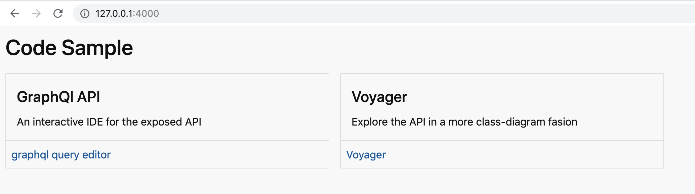
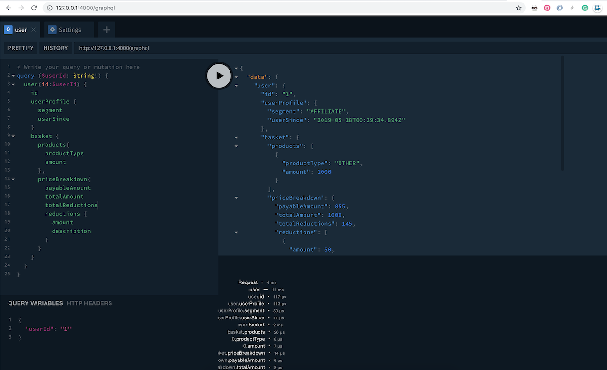
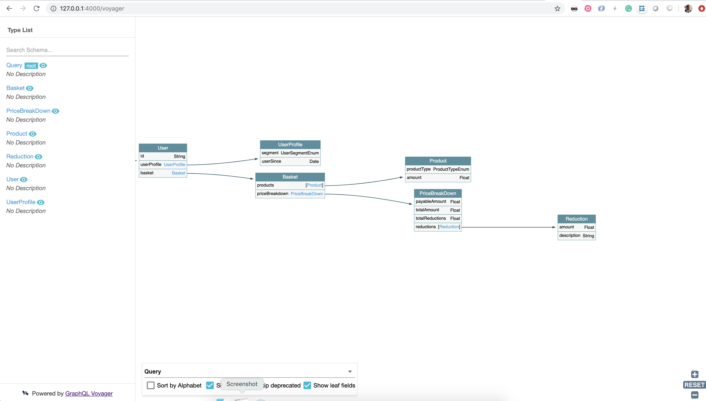

# code sample project

[](https://travis-ci.org/plaenen/code-sample)
[](https://codecov.io/gh/plaenen/code-sample)

This is a code-sample which required the following functionality

On a retail website, the following discounts apply:
1. If the user is an employee of the store, he gets a 30% discount
2. If the user is an affiliate of the store, he gets a 10% discount
3. If the user has been a customer for over 2 years, he gets a 5% discount.
4. For every $100 on the bill, there would be a $ 5 discount (e.g. for $ 990, you get $ 45 as a discount).
5. The percentage based discounts do not apply on groceries.
6. A user can get only one of the percentage based discounts on a bill.





Traditionally in programming languages like Java, Python an OOP style approach would be taken.
However in this sample takes a more standard javascript approach. Which will evolve through time. 

>Working software is the primary measure of progress. 
>~~ [Agile manifesto principle](https://agilemanifesto.org/principles.html)

Therefore I focused on getting it working, then go through continuous improvement. This allows us to iterate without making big upfront designs. 

* Code is available under the [./lib](./lib) folder
* Test under [./test](./test) 

The code is structured in a way that it can easily be split in different micro-services. 
Each of the [./lib/services](./lib/services) could be split off when the project grows or scaling requirements might justify splitting parts off. 

see [Documentation](./docs/readme.md) for more details and screen-shots of the solution

* [Installing and running the application](./docs/install.md)
* [Continuous Integration](./docs/ci-cd.md)

## What's next

* [ ] build integration test
* [ ] provide proper JSDOCS
* [ ] automatic deploy to AWS
* [ ] harden to code to make it production ready, exception handling etc 
  * [ ] ensure node remains running pm2?
  * [ ] remove mock services and implement them
  * [ ] security, login with OAuth?
* [ ] improve code coverage
* [ ] ...


## Using the graphql editor

* Browse to [http://127.0.0.1:4000/graphql](http://127.0.0.1:4000/graphql)
* Add the following query

```
query ($userId: String!) {
  user(id:$userId) {
    id
    userProfile {
      segment
      userSince
    }
    basket {
      products{
        productType
        amount
      },
      priceBreakdown{
        payableAmount
        totalAmount
        totalReductions
        reductions {
          amount
          description
        }
      }
    }
  }
}
```

* And the following query variables

```
{
  "userId": "1"
}
```

* Now run the query

The following mocked users are available

0. Employee (userId = 0)
1. Affiliate (userId = 1)
2. Customer with more than 2 years loyalty (userId = 2)
3. Customer wiht less than 2 years loyalty (userId = 3)


