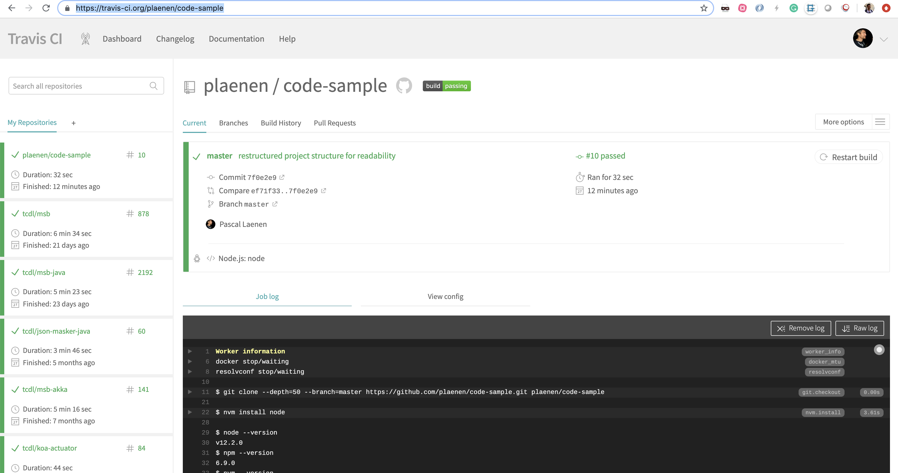
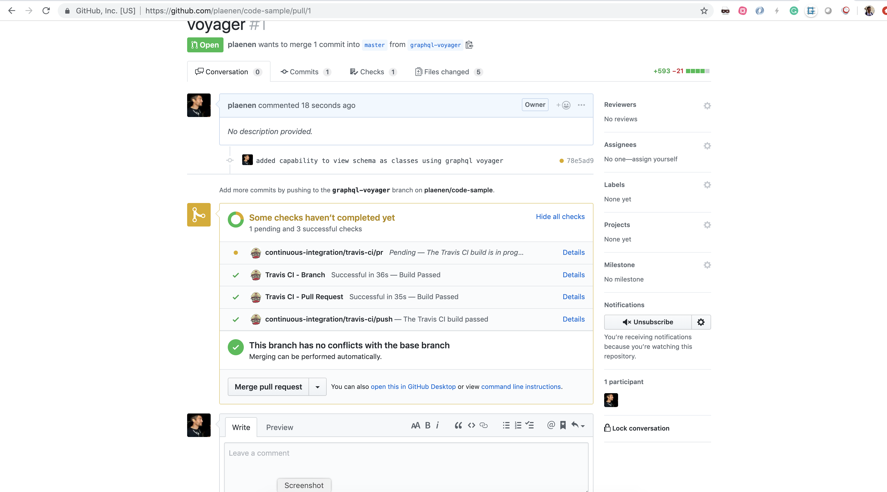

## Continuous integration

We use [travis-ci](https://travis-ci.org/plaenen/code-sample) as Continuous integration tool and the build status can be found in the badge on top of this page. 

__current ci-cd pipeline__

* Unit tests
* Code Coverage 
* Feedback Badges in GitHub (see [README.md](./../README.md)

The current ci-cd pipeline is a very basic implementation, further enhancements are required. 

## Screen-shots

__Our ci-cd pipeline__

__And merging in-github__

