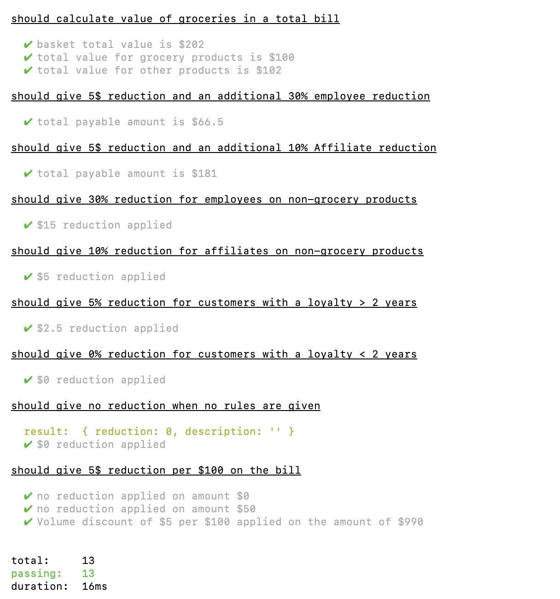
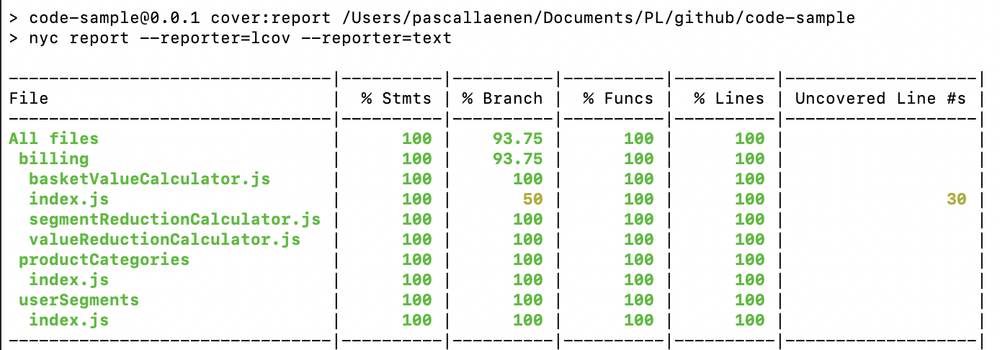

## Installation & Usage

1. clone the repository 

```
git clone https://github.com/plaenen/code-sample.git
```

2. install pre-requisites

node v10.10.0  or higher [download](https://nodejs.org/en/download/)

3. install dependencies

npm install

4. run the application 

```
npm start
```

## Testing

```
npm test
```



## Code Coverage

```
npm run codecov
```

Reports can be found under ./coverage
And a visual representation under ./coverage/lcov-report

Remark: Further improvement to be done to get overall test coverage reporting in place. 



## Linting

```
npm run lint
```

or with auto-fix

```
npm run lint-fix
```
